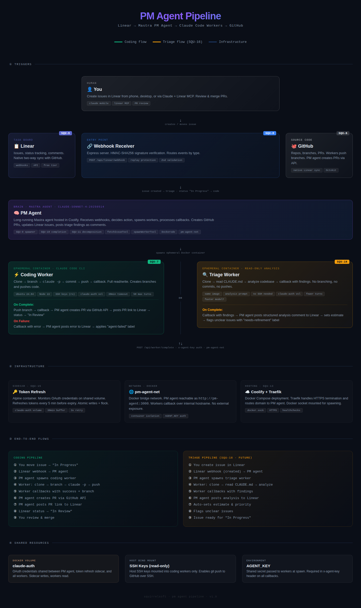

# PM Agent Pipeline

An AI-powered development pipeline that turns Linear issues into GitHub pull requests — automatically. A Mastra PM agent receives Linear webhooks, spawns ephemeral Docker containers running Claude Code, and manages the full lifecycle from task assignment through code review.



> [View interactive architecture diagram →](https://pipeline.squirrel.dev)

## How It Works

1. You create or move an issue to "In Progress" in Linear
2. Linear fires a webhook to the PM agent
3. The PM agent spawns an ephemeral Docker container with Claude Code
4. The worker clones the repo, creates a branch, writes code, commits, and pushes
5. On success, the PM agent creates a GitHub PR and links it back to Linear
6. The Linear issue moves to "In Review" — you just review and merge

## Stack

- **[Mastra](https://mastra.ai)** — AI agent framework (PM agent orchestration)
- **[Claude Code](https://docs.anthropic.com/en/docs/claude-code)** — Anthropic's CLI for agentic coding
- **[Linear](https://linear.app)** — Issue tracking with webhook events
- **[Docker](https://docker.com)** — Ephemeral worker containers via socket mount

## Architecture

### Components

| Component                 | Description                                                  |
| ------------------------- | ------------------------------------------------------------ |
| **PM Agent**              | Long-running Mastra agent. Receives webhooks, decides actions, spawns workers, processes callbacks, creates PRs. |
| **Webhook Receiver**      | Express server with HMAC-SHA256 signature verification and replay protection. |
| **Worker Spawner**        | Dockerode-based module that creates ephemeral containers on a shared Docker network. |
| **Coding Worker**         | Ubuntu 24.04 container with Claude Code CLI. Clones, branches, codes, commits, pushes, callbacks. |
| **Completion Handler**    | Processes worker callbacks. Creates GitHub PRs via Octokit, updates Linear issues. |
| **Token Refresh Sidecar** | Alpine container that monitors OAuth credentials and refreshes tokens before expiry. |

### Networking

All containers run on a shared `pm-agent-net` Docker network. Workers reach the PM agent at `http://pm-agent:3000` via internal hostname. External traffic routes through Traefik with HTTPS termination.

Worker callbacks are authenticated with a shared `AGENT_KEY` passed via the `x-agent-key` header.

### Authentication

Claude Code OAuth tokens expire every 1–4 hours, and the built-in refresh mechanism is broken in headless/container environments. The token refresh sidecar solves this by:

- Monitoring `~/.claude/.credentials.json` on a shared Docker volume (`claude-auth`)
- Refreshing tokens 30 minutes before expiry via the Anthropic OAuth endpoint
- Writing credentials atomically (temp file + rename) with `flock` for concurrency safety
- Retrying 3x with exponential backoff on network failures

Initial authentication requires running `claude` interactively once to complete the OAuth flow.

## Project Structure

```
├── src/
│   ├── config.ts              # Zod-validated environment config
│   ├── index.ts               # Express server entry point
│   ├── agents/
│   │   └── pm-agent.ts        # Mastra PM agent definition
│   ├── services/
│   │   └── docker.service.ts  # Worker spawner (Dockerode)
│   └── tools/
│       ├── fetch-issue.ts     # Linear issue fetcher
│       └── spawn-worker.ts    # Worker spawn tool
├── token-refresh/
│   ├── Dockerfile             # Alpine + curl + jq + coreutils
│   └── refresh.sh             # Token monitoring and refresh logic
├── Dockerfile                 # Worker image (Ubuntu 24.04 + Claude Code)
├── worker-entrypoint.sh       # Worker lifecycle script
├── pm-agent.Dockerfile        # PM agent image (Node 22 + Docker CLI)
├── docker-compose.yml         # PM agent + token refresh sidecar
├── test-worker.sh             # Worker build/auth/SSH/e2e test harness
└── docs/
    └── architecture.png       # Architecture diagram
```

## Roadmap

### Completed

- [x] Webhook receiver with HMAC verification (SQU-8)
- [x] Docker worker image with Claude Code (SQU-7)
- [x] Worker spawner module (SQU-9)
- [x] OAuth token refresh sidecar (SQU-15)
- [x] Completion handler with GitHub PR creation (SQU-10)
- [x] Multi-repo support via label-based repo mapping (SQU-17)

### In Progress

- [ ] Worker mode system — triage, respond, implement, review (SQU-21)
- [ ] Create AI workflow label scheme (SQU-26)

### Up Next

- [ ] Triage workflow — auto-analyze new issues (SQU-22) — *blocked by SQU-21*
- [ ] @agent conversation workflow (SQU-23) — *blocked by SQU-21*
- [ ] Enhanced implement — incorporate triage plan & review feedback (SQU-24) — *blocked by SQU-21, SQU-22*
- [ ] Code review workflow — severity-based routing (SQU-25) — *blocked by SQU-21, SQU-24, SQU-26*

### Backlog

- [ ] Task decomposition agent (SQU-11)
- [ ] End-to-end pipeline testing (SQU-12)
- [ ] Production deployment (SQU-13)
- [ ] CLAUDE.md files for target repos (SQU-14)
- [ ] Triage worker for automatic issue analysis (SQU-16)

## Setup

### Prerequisites

- Docker with Docker Compose
- A Linux server (for deployment) or local Docker for development
- Linear workspace with API key
- GitHub PAT with `repo` scope
- Anthropic account with Claude Max subscription (for Claude Code)

### Host Server Setup

For detailed host-level configuration (SSH keys, Claude Code OAuth, volume permissions), see the **[Host Setup Guide](./docs/HOST-SETUP.md)**.

### Repo Label Group

The PM agent uses Linear's label system to map issues to repos dynamically. A single agent instance can handle issues across multiple projects and repos.

**1. Create a label group in Linear:**

- Go to **Settings > Labels** in your Linear workspace
- Create a new label group named **Repo** (or a custom name — set `REPO_LABEL_GROUP` env var)

**2. Add a child label for each repo:**

- Under the **Repo** group, create a child label for each repository
- **Name**: the repo shortname (e.g. `linear-claude-agent`)
- **Description**: the SSH URL (e.g. `git@github.com:squirrelsoft-dev/linear-claude-agent.git`)

**3. Create project issue templates (recommended):**

- In each Linear project, create an issue template that auto-applies the correct repo label
- Set the template as the project's default template
- New issues in the project will automatically get the repo label

**Adding a new repo** requires only creating a child label and (optionally) a project template — no PM agent restart needed.

### Environment Variables

Copy `.env.example` to `.env` and configure:

```env
# Linear
LINEAR_API_KEY=lin_api_...
LINEAR_WEBHOOK_SECRET=...

# Anthropic (for PM agent, not workers)
ANTHROPIC_API_KEY=sk-ant-...

# GitHub (for PR creation)
GITHUB_TOKEN=ghp_...

# Security
AGENT_KEY=<generate-a-strong-secret>

# Worker Config
REPO_LABEL_GROUP=Repo        # Linear label group name for repo mapping (default: Repo)
WORKER_IMAGE=claude-worker:latest
WORKER_NETWORK=pm-agent-net
WORKER_TIMEOUT=1800
WORKER_MAX_TURNS=50
CALLBACK_BASE_URL=http://pm-agent:3000
HOST_SSH_PATH=/home/user/.ssh
HOST_CLAUDE_AUTH_PATH=claude-auth

# Server
PORT=3000
LOG_LEVEL=info
PM_AGENT_MODEL=claude-sonnet-4-20250514
```

| Variable | Required | Default | Description |
| --- | --- | --- | --- |
| `REPO_LABEL_GROUP` | No | `Repo` | Name of the Linear label group whose child labels map to repos. Each child label's description must contain the repo's SSH URL. |

### Initial OAuth Setup

Workers run as a non-root `worker` user (UID 1001). OAuth credentials are stored on a shared Docker volume and must be created by authenticating as that user.

See the **[Host Setup Guide — Claude Code OAuth](./docs/HOST-SETUP.md#2-claude-code-oauth-authentication)** for the full walkthrough.

### Running

```bash
# Build and start PM agent + token refresh sidecar
docker compose up -d --build

# Build the worker image
docker build -t claude-worker .

# Check logs
docker compose logs -f pm-agent
docker compose logs -f token-refresh
```

### Testing the Worker

```bash
# Build test
./test-worker.sh build

# Test Claude auth
./test-worker.sh auth

# Test SSH git clone
./test-worker.sh ssh

# Full end-to-end test
./test-worker.sh e2e
```

## API Endpoints

| Endpoint               | Method | Auth          | Description                |
| ---------------------- | ------ | ------------- | -------------------------- |
| `/health`              | GET    | None          | Health check               |
| `/api/linear/webhook`  | POST   | HMAC-SHA256   | Linear webhook receiver    |
| `/api/worker/complete` | POST   | `x-agent-key` | Worker completion callback |

## How Workers Execute Tasks

The worker entrypoint script (`worker-entrypoint.sh`) handles the full lifecycle:

1. **Clone** the repository via SSH
2. **Branch** from the base branch (e.g. `ai/SQU-42-fix-login-bug`)
3. **Run** `claude -p` with the task prompt, allowed tools (Edit, Write, Bash, Read), and `--dangerously-skip-permissions`
4. **Commit** all changes with a descriptive message
5. **Push** the branch to the remote
6. **Callback** to the PM agent with status, branch name, and any errors

Workers have a configurable timeout (default 30 minutes) with a watchdog process. On SIGTERM/SIGINT, they clean up gracefully and report back.

## Security

- **Webhook verification**: Linear webhooks validated with HMAC-SHA256 signatures and 60-second replay protection
- **Network isolation**: Workers communicate with the PM agent over an internal Docker network only
- **Callback authentication**: All worker callbacks require a valid `x-agent-key` header
- **Read-only credentials**: Workers mount the `claude-auth` volume as read-only
- **SSH key isolation**: SSH keys are host bind-mounted read-only into coding workers only
- **Docker socket**: Mounted on the PM agent container (required for spawning workers)

## Troubleshooting

### "No 'Repo' label group found in your Linear workspace"

The PM agent failed to find the repo label group on startup. Fix:

1. In Linear, go to **Settings > Labels**
2. Create a label group named **Repo** (or whatever `REPO_LABEL_GROUP` is set to)
3. Add at least one child label with the repo's SSH URL in its description
4. Restart the PM agent

### "No repo label found" comment on an issue

The issue was moved to "In Progress" but doesn't have a label from the repo group. The agent posts a comment and moves the issue back to "Todo". Fix:

1. Add the correct repo label (from the **Repo** group) to the issue
2. Move the issue back to "In Progress"

### "Repo label found but has no description"

A repo label was found on the issue, but its description is empty. The description must contain the SSH URL. Fix:

1. In Linear **Settings > Labels**, edit the child label under the repo group
2. Set its description to the SSH URL (e.g. `git@github.com:org/repo.git`)
3. Move the issue back to "In Progress"

## License

Private — SquirrelSoft LLC
